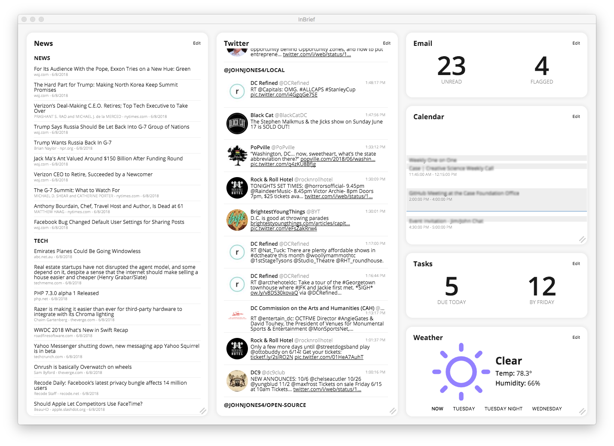

# InBrief

[](https://travis-ci.org/johnjones4/InBrief)
[](https://codeclimate.com/github/johnjones4/InBrief/maintainability)

[](https://github.com/standard/standard)



## About

InBrief is a personal briefing app and dashboard powered by Electron and React. In one screen, InBrief provides an overview of your top RSS feeds, Twitter lists, local weather, email unread and flagged status, todos, and schedule. This app is meant to be the homepage and daily starting place for its users.

Each widget on the app's screen draws its data via various APIs, and InBrief is designed to support future widgets and APIs as is necessary or desired. The current supported services/APIs are:

* ICS calendar feeds
* Microsoft Exchange Web Services calendars
* Microsoft Exchange Web Services email
* IMAP email (including GMail)
* RSS/Atom
* Todoist
* Asana
* Twitter
* Weather Underground

## Installation

To install InBrief on your computer, head to the [Releases](https://github.com/johnjones4/InBrief/releases) section and download the appropriate file for your system. (Currently, there are only builds for Linux and Mac)

## Setup

By default, all configurations for the various widgets contain ultra-bare-bones information. Please use the following example configurations below for more information on how to configure the widgets:

### Calendar

```JSON
{
  "calendars": [
    {
      "type": "ics",
      "url": ""
    },
    {
      "type": "exchange",
      "credentials": {
        "username": "",
        "password": "",
        "url": "http://example.com/Ews/Exchange.asmx"
      }
    }
  ]
}
```

### Email

```JSON
{
  "mailboxes": [
    {
      "type": "exchange",
      "credentials": {
        "username": "",
        "password": "",
        "url": "http://example.com/Ews/Exchange.asmx"
      }
    },
    {
      "type": "imap",
      "credentials": {
        "user": "",
        "password": "",
        "host": "imap.gmail.com",
        "port": 993,
        "tls": true
      },
      "flagMailboxName": "[Gmail]/All Mail",
      "unreadMailboxName": "Inbox"
    }
  ]
}
```

### RSS

```JSON
{
  "max": 10,
  "sets": [
    {
      "title": "News",
      "feeds": [
        "http://rss.nytimes.com/services/xml/rss/nyt/HomePage.xml"
      ]
    },
    {
      "title": "Tech",
      "feeds": [
        "https://news.ycombinator.com/rss"
      ]
    },
    {
      "title": "Open Source",
      "feeds": [
        "http://opensource.com/feed"
      ]
    }
  ]
}
```

### Tasks

```JSON
{
  "apis": [
    {
      "type": "todoist",
      "token": ""
    },
    {
      "type": "asana",
      "token": ""
    }
  ]
}
```

### Twitter

```JSON
{
  "credentials": {
    "consumer": {
      "key": "",
      "secret": ""
    },
    "access": {
      "token": "",
      "tokenSecret": ""
    }
  },
  "lists": [
    {
      "owner": "johnjones4",
      "slug": "open-source",
      "title": "Open Source"
    }
  ]
}
```

### Weather

```JSON
{
  "key": "",
  "location": "22314"
}
```